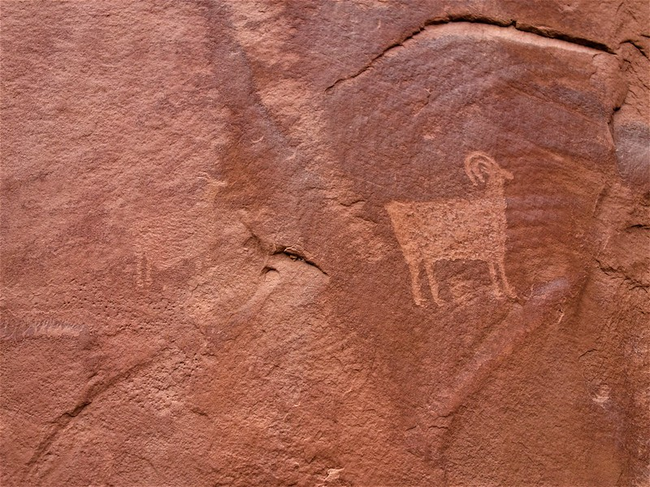
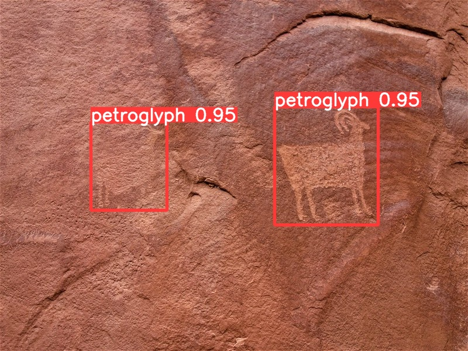
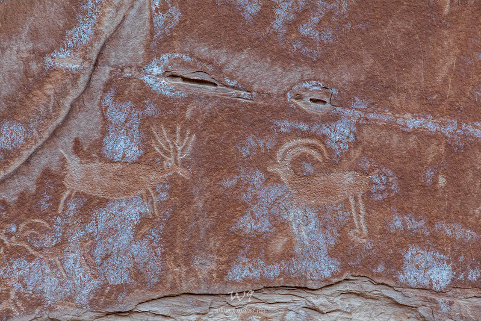
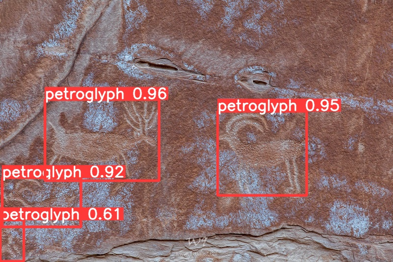
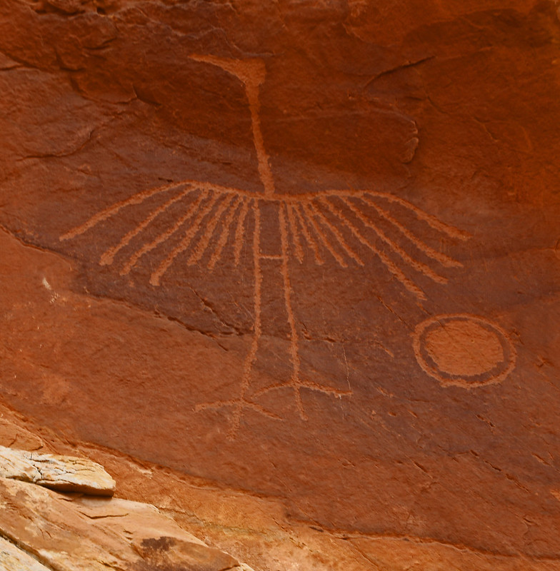
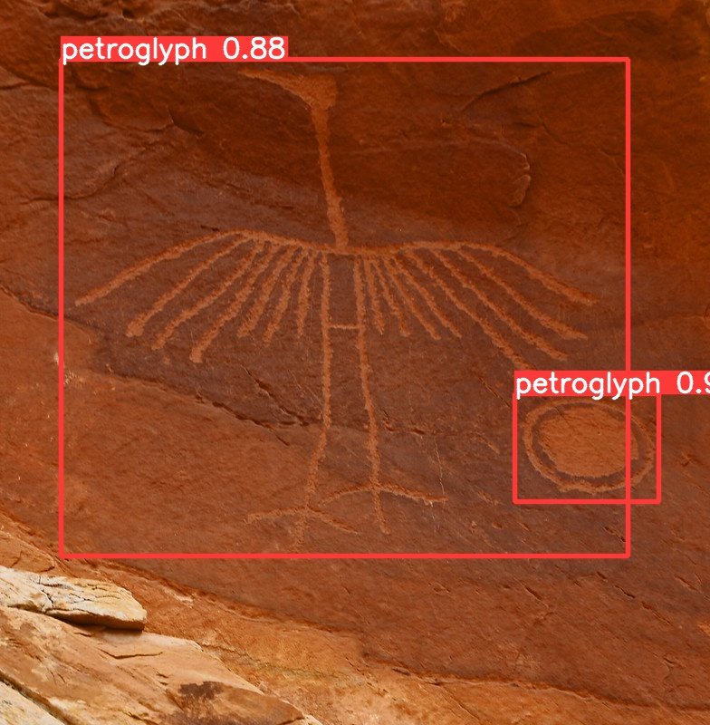
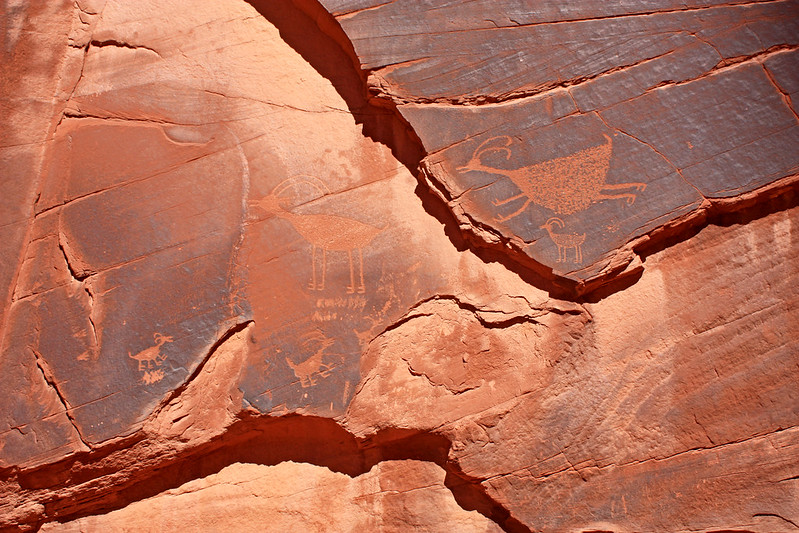
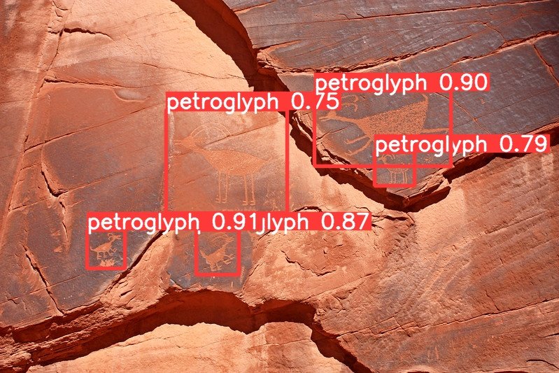
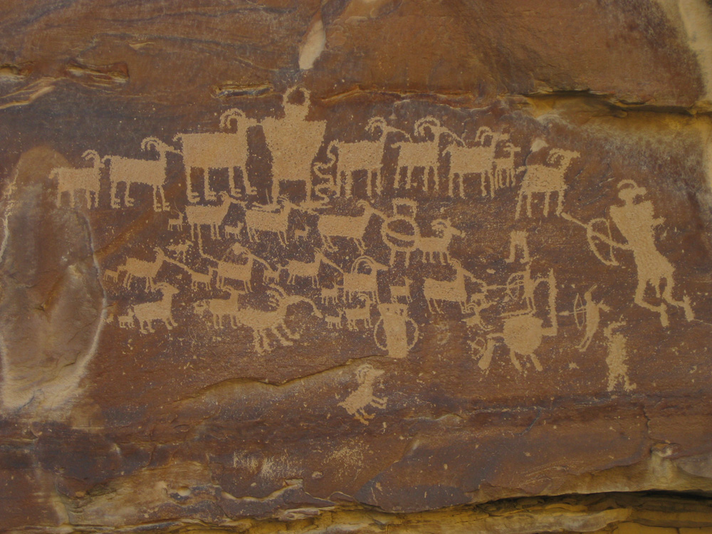
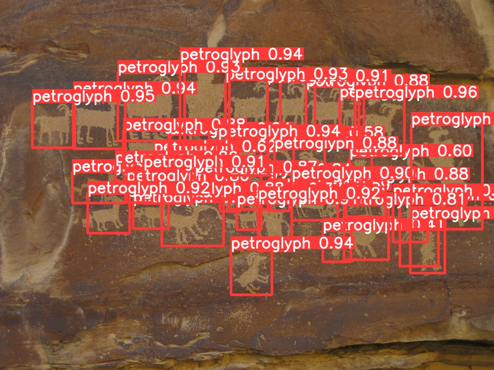

# Petroglyph Detection
Detecting petroglyphs in an image by training a YOLOv5 object detection model.  

This Colab notebook loads a pre-trained YOLOv5 model and predicts bounding boxes for images of petroglyphs. Trained on a custom dataset of 1,000 images of petroglyphs, annotated with bounding boxes by me. The model was trained using the YOLOv5 tutorial notebook found [here](https://colab.research.google.com/github/ultralytics/yolov5/blob/master/tutorial.ipynb).  

## Image Sources
Used the Flickr API to download images:
- Flickr Group: ["Indian Rock Art"](https://www.flickr.com/groups/700739@N20/pool/)
- Flickr Group: ["Petroglyphs ~"](https://www.flickr.com/groups/43719540@N00/)

## Acknowledgment of Bias
This project is intended only as a learning experience in computer vision, not as an academic work. Several thousand images were downloaded from Flickr, inspected for glyphs, and arbitrarily decided on whether or not to label. Some images showed panels with hundreds of small glyphs; some images showed densely interconnected patterns from which individual glyphs could not be distinguished; many contained isolated dots, lines or splotches; all of which the annotator (me) simply ignored.  

The initial assumption was that petroglyphs are made of distinct symbols, like words, and that each individual symbol was delimited by the surrounding space - thus easily placed within a bounding box. But this assumption didn't hold up, so instead I settled for just labeling images with a low number of clearly defined symbols. I hope this

## Examples

